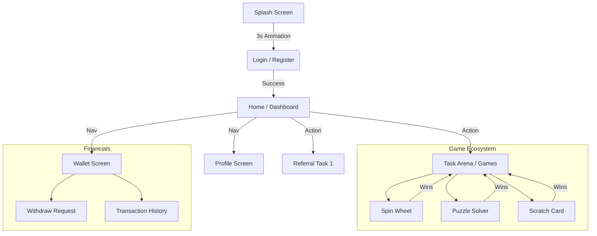

# UI Design Workflow & User Journey
# QUBO: Premium Referral & Gaming App

## 1. Design Philosophy
The UI design for the QUBO app is centered around a **"Premium Obsidian & Gold"** aesthetic. The goal is to move away from generic utility app visuals and create an immersive, high-end experience that feels valuable and rewarding.

### 1.1 Visual Identity
*   **Theme**: Dark Mode Exclusive.
*   **Primary Palette**:
    *   *Obsidian Black* (`#000000` to `#121212`): Backgrounds and negative space.
    *   *Metallic Gold* (`#FFD700` -> `#B8860B`): Primary actions, highlights, borders, and rewards.
    *   *Graphite* (`#1E1E1E`): Surface cards and containers.
*   **Typography**: Clean, modern, sans-serif fonts (e.g., *Inter* or *Outfit*) with varied weights to establish hierarchy.
*   **Effects**:
    *   *Glassmorphism*: Subtle transparency with blurs on overlays.
    *   *Neomorphism*: Soft shadows for depth on buttons.
    *   *3D Elements*: Applied to gamified components (Spin Wheel, Scratch Card).

---

## 2. User Flow Architecture
The user journey is designed to be linear for onboarding and hub-and-spoke for core interactions.

---

## 3. Critical UI Components & Screens

### 3.1 Splash Screen
*   **Visuals**: Animated App Logo centered on a black background.
*   **Interaction**: Auto-redirect after initialization.
*   **Vibe**: Minimalist, creating anticipation.

### 3.2 Authentication (Login/Register)
*   **Layout**: Centralized form card floating on a dark gradient background.
*   **Inputs**: Gold-outlined text fields with glowing focus states.
*   **Buttons**: Solid gold gradient buttons with black text for high contrast.

### 3.3 Home Dashboard
*   **Header**: User greeting, Avatar, and Notification bell.
*   **Hero Section**: Current Balance display with a metallic sheen effect.
*   **Task List**:
    *   *Referral Tasks*: Progress bars indicating referral counts (1, 6, 12, etc.).
    *   *Status Indicators*: Locked (Greyed out), Active (Gold Pulse), Completed (Green Check).
*   **Navigation**: Quick access to Wallet, Profile, and Games.

### 3.4 The Game Arena (TasksScreen)
*   **Concept**: A 3D-styled lobby where games are displayed as physical cards or machines.
*   **Mechanic**: Sequential Locking.
    1.  **Spin Wheel**:
        *   *UI*: 3D tilted wheel with metallic rim. Realistic physics.
    2.  **Puzzle Game**:
        *   *UI*: Blocks with depth/shadows sitting in a tray. Unlocks after Wheel.
    3.  **Scratch Card**:
        *   *UI*: Gold foil overlay that particles away when scrubbed. Unlocks after Puzzle.

### 3.5 Wallet & Earnings
*   **Design**: Clean, data-heavy but legible.
*   **Elements**:
    *   Earnings Chart (if applicable).
    *   Recent Transactions list with color-coded amounts (+Green, -Red).
    *   Withdrawal methods carousel.

---

## 4. Interaction Design & Micro-interactions
*   **Feedback**: Every tap has a subtle scale-down animation.
*   **Success**: Confetti explosions or gold particle effects when a task is completed or money is earned.
*   **Transitions**: Smooth `FadeThrough` or `SharedAxis` transitions between screens to maintain the "premium" feel.
*   **Loading**: Custom gold spinners or skeletal loaders instead of default system circular progress indicators.

## 5. Implementation Workflow
1.  **Draft**: Wireframe generic layouts (Completed).
2.  **Style**: Apply `ThemeData` globally (Colors, Fonts) (In Progress).
3.  **Components**: Build reusable `GradientButton`, `CustomTextField`, `GlassContainer`.
4.  **Polish**: Add animations (Lottie, Rive, or implicit Flutter animations).
